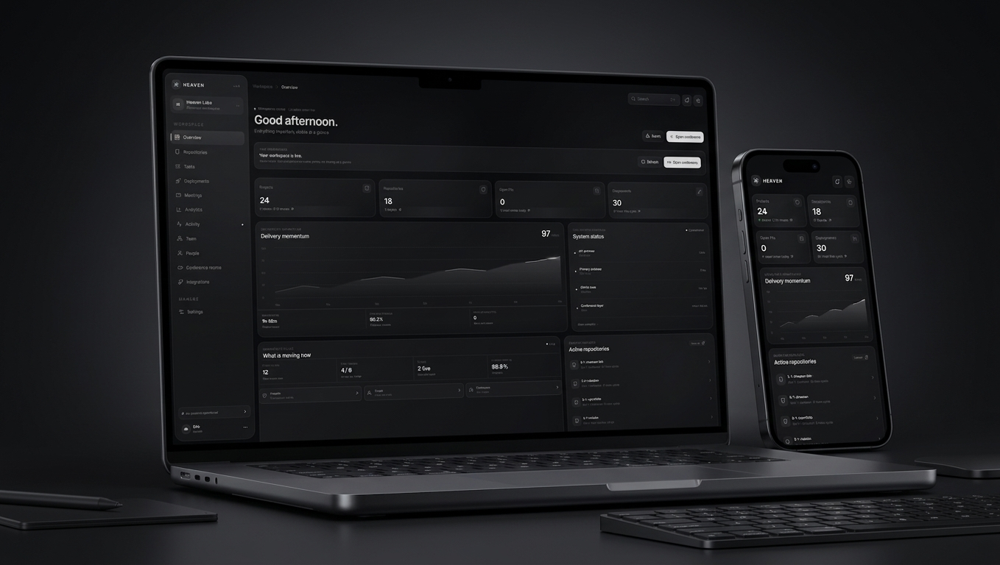

# HEAVEN


Developer command center — a full-stack workspace that brings GitHub repositories, engineering activity, deployments, meetings, integrations, and team collaboration into one focused interface.

Built with Next.js, Clerk Organizations, Neon PostgreSQL, and OAuth integrations (GitHub, Zoom).

## Live Demo
 [heaven-b1o.vercel.app](https://heaven-b1o.vercel.app/)





## Features
- GitHub repository and commit views
- Workspace and team management via Clerk Organizations
- GitHub OAuth integration
- Zoom meeting integration (launches in desktop app)
- Discord event integration
- Neon PostgreSQL persistence
- Encrypted integration tokens
- Glass / fog inspired interface
- Authenticated API routes and OAuth callbacks
- Vercel-ready production architecture

## Tech Stack
Next.js · React · TypeScript · Neon PostgreSQL · Clerk · GitHub OAuth · Zoom OAuth · Discord · Vercel · Lucide React

## Architecture
- Next.js App Router with server-side API routes for authenticated operations.
- Clerk Organizations handle multi-tenant workspaces; each org has its own integrations and data scope.
- OAuth tokens are encrypted before being stored in Neon PostgreSQL.
- GitHub and Zoom data is fetched via their APIs using the stored tokens.
- Static hosting is not sufficient — the app requires authenticated API routes and OAuth callbacks, so it runs as a Next.js server application on Vercel.

## Getting Started
```bash
git clone https://github.com/b-1-o/heaven.git
cd heaven
npm install
